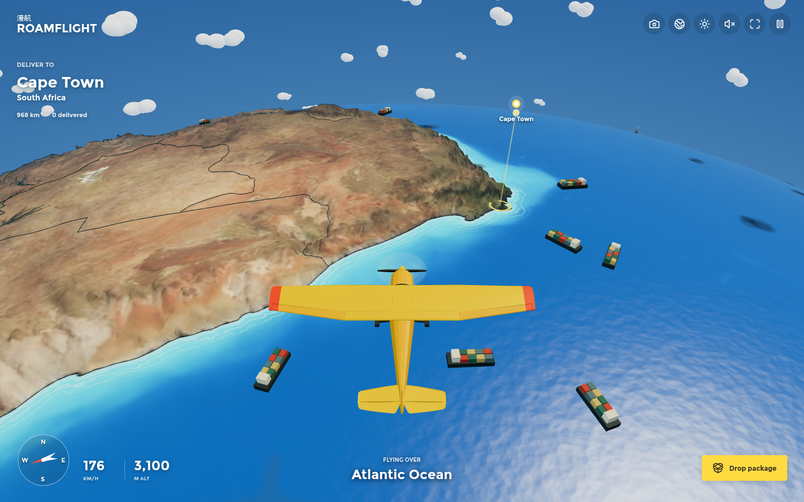

# Roamflight · 漫航

**驾驶你的飞机，飞越真实世界，在城市、山川与海岸之间发现新的旅程。**

**Explore the real world from your own aircraft. Discover new journeys between
cities, mountains and coastlines.**

Roamflight is an exploration-focused flying game for the browser. The journey
matters as much as the destination: choose a route, discover places along the way,
complete a flight or delivery, and set out again.



The current playable prototype uses a miniature real-world globe. Detailed city
flyovers, airports, progression and additional aircraft are the long-term vision,
not features already present in this release.

## Play

- Local/LAN: `http://192.168.110.223:4177/`
- Tailnet: `http://100.92.174.90:4177/`
- Public game: **https://roamflight.wooo.guru/**.
- Pages fallback: https://roamflight.pages.dev/.
- Source: [daoleno/roamflight](https://github.com/daoleno/roamflight).

Each visitor plays an independent session. This is not a multiplayer game.

## Current Prototype

- Fly around a real geographical globe with terrain relief, coastlines and borders.
- Steer, bank, change air speed and boost with keyboard or touch controls.
- Pitch up or down to climb and descend, with a protective terrain clearance.
- See ailerons respond to turns and navigation lights fade in at night.
- Drop parachute packages, receive delivery feedback and advance destinations.
- Switch between chase, reverse and overhead views, or orbit the globe map.
- Depart from Southern Africa, the Alps, the Himalayas, the Andes or New Zealand.
- Use a single authored audio preset with quiet flight ambience, gentle harmonies
  and contextual cues. Sound is opt-in; there is no mixer to configure.

The day/night switch is illustrative. Flight is stylized rather than a realistic
aerodynamic simulation. Flight progress is not persisted.

## Development

Use Node.js 24 (minimum 22.12). No API keys or external map services are required
to play or develop locally; runtime assets are included in the repository.

```sh
npm ci
npm run dev -- --port 5173 --strictPort
```

```sh
npm test
npm run format:check
npm run build
npm start
```

The production server binds port 4177 and exposes only `dist/` and `/healthz`.
On the development host, the existing `roamflight.service` already owns 4177;
use 5173 for development or stop that service before running another server.

## Controls

| Input                                  | Action                                      |
| -------------------------------------- | ------------------------------------------- |
| A / D or Left / Right                  | Turn and bank                               |
| W / S or Up / Down                     | Increase / decrease speed                   |
| Q / E                                  | Descend / climb                             |
| Shift                                  | Boost                                       |
| Space                                  | Drop a package                              |
| C                                      | Change camera                               |
| M                                      | Globe map; drag to orbit and scroll to zoom |
| N                                      | Day / night                                 |
| F                                      | Fullscreen                                  |
| Escape                                 | Pause                                       |
| Drag horizontally on the flight canvas | Steer                                       |
| Speaker icon                           | Enable / mute the audio preset              |

Phones have steering, climb/descend, boost and package buttons. Browser audio requires an explicit
gesture: tap the speaker icon after loading. Pausing or switching away fades sound
to silence. Use the device volume for overall loudness; old mixer preferences are
ignored. Packages landing within 190 km of a destination count as successful in
this early prototype.

## Verification

Node tests cover geography, spherical movement, propeller pivots, the audio preset,
terrain conversion and HTTP delivery/security. Browser tests generate screenshots,
canvas checks and audio-signal evidence in the ignored `verification/` directory.

```sh
CDP_URL=http://127.0.0.1:9222 TEST_URL=http://127.0.0.1:4177 npm run verify
CDP_URL=http://127.0.0.1:9222 TEST_URL=http://127.0.0.1:4177 node scripts/verify-audio.mjs
```

CI checks formatting, tests and the build on pushes and pull requests. Cloudflare
deployment has a separate, explicitly triggered workflow with scoped credentials.

## Documentation

- [Implementation plan](docs/IMPLEMENTATION_PLAN.md): ordered increments, acceptance criteria and per-commit progress.

- [Product direction](docs/PRODUCT.md): positioning, principles and the intended play loop.
- [Roadmap](docs/ROADMAP.md): implemented work and future milestones.
- [Upstream audit](docs/UPSTREAM_AUDIT.md): source-backed gaps and the next implementation priorities.
- [Architecture](docs/ARCHITECTURE.md): rendering, data, audio and runtime boundaries.
- [Deployment](docs/DEPLOYMENT.md): Cloudflare Pages, local systemd and Docker.
- [Contributing](CONTRIBUTING.md): development and verification expectations.
- [Credits](public/credits.html): original work and asset attribution.

## Origins And Attribution

**Thank you, Sebastian Lague**, for sharing the code, data-processing work and
development videos behind Geographical Adventures. Roamflight's starting point
would not exist without that work.

Roamflight started as an independent browser adaptation of Sebastian Lague's
[Geographical Adventures](https://github.com/SebLague/Geographical-Adventures),
inspired by [this development video](https://youtu.be/sLqXFF8mlEU). It is not an
official release, an original Unity WebGL build or a pixel-identical reproduction.

Terrain, aircraft and geographical assets originate from upstream commit
`82fcda20bebb033c749b2339e9ce3a6e58007699`, with changes made after that first video.
The original MIT notice is retained in `public/assets/LICENSE-original.txt`;
Montserrat's license is retained alongside it. Geography sources credited by the
original project include Natural Earth, NASA Blue Marble and GEBCO.

Large source textures live in ignored `reference/`. Regenerate optimized assets with:

```sh
node scripts/assets.mjs
node scripts/prepare-assets.mjs
```

The current browser shaders, procedural soundscape, controls and missions are
independent implementations. No soundtrack recordings from the video are used.

## License

Roamflight is an **MIT-licensed project**; see [LICENSE](LICENSE). This does not
replace third-party copyright notices or licenses. Sebastian Lague's original MIT
notice and the font license remain in `public/assets/` and are included in builds.
